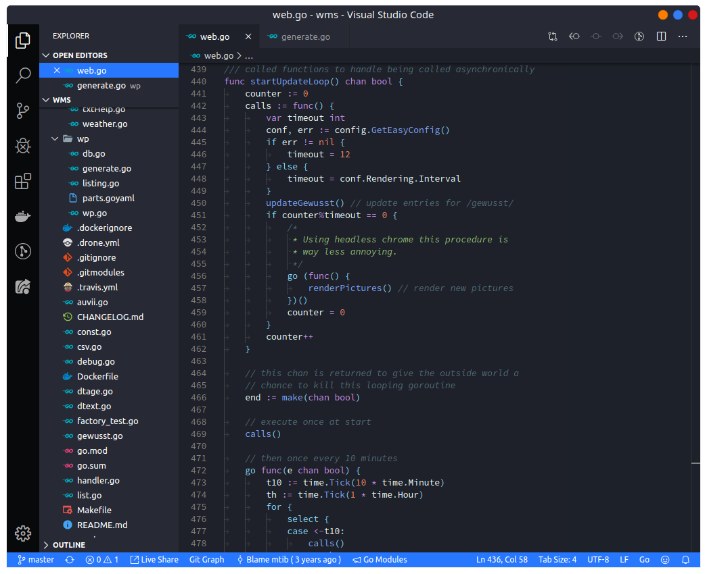

# Flat Dark Remix VSCode

I made this from scratch bc there wasn't a Flat Remix VSCode Theme. The file icon theme of the screenshot is "Material Icon Theme".

## Links

- [Flat Remix Blue](https://www.pling.com/p/1214931/) - Shell Theme
- [Flat Remix Dark](https://www.pling.com/p/1013030) - Application Theme
- [Flat Remix ICON](https://www.pling.com/p/1012430/) - Icon Theme
